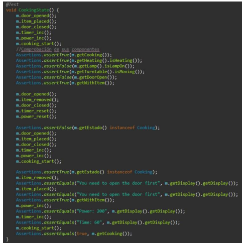
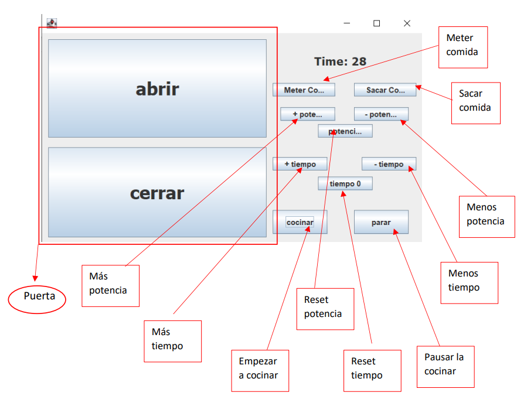

# Microwave Java Implementation

Este proyecto tiene como objetivo la implementación de un microondas en Java. El diseño del microondas se compone de diferentes clases que interactúan entre sí según las acciones realizadas por el usuario. Se empleará el patrón de diseño de estado, estudiado en clase, para definir diversas situaciones posibles para el microondas, que incluyen:

1. **Cerrado y sin nada dentro**
2. **Abierto y sin nada dentro**
3. **Abierto y con comida dentro**
4. **Cerrado y con comida dentro**
5. **Cocinando**

Para realizar transiciones entre estos estados, el microondas debe cumplir requisitos específicos. Por ejemplo, para introducir comida, la puerta debe estar abierta previamente. Además, el microondas cuenta con otros componentes como la lámpara o el calentador, que son implementables y accesibles.

## Funcionalidades Destacadas

- **Patrón de Estado:** Se utiliza el patrón de diseño de estado para gestionar las distintas situaciones del microondas de manera eficiente.

- **Componentes Modulares:** Los componentes del microondas, como la lámpara o el calentador, son implementables y accesibles, permitiendo una mayor flexibilidad en el diseño.

- **Pruebas Unitarias:** Se han implementado pruebas unitarias utilizando JUnit para garantizar la robustez del código.

- **Pruebas de Comportamiento:** Se han incorporado pruebas con Cucumber para evaluar el comportamiento del microondas en diferentes escenarios.

- **Interfaz Gráfica:** Se ha integrado una interfaz gráfica para mejorar la experiencia del usuario y facilitar la interacción con el microondas.

## Pruebas

El proyecto incluye pruebas exhaustivas para validar el correcto funcionamiento del microondas. Se han utilizado tanto pruebas unitarias con JUnit como pruebas de comportamiento con Cucumber.

## Interfaz Gráfica

Para una experiencia de usuario más amigable, se ha implementado una interfaz gráfica que simplifica el uso del microondas. Esta interfaz facilita la interacción del usuario con las distintas funciones del dispositivo.

---

¡Gracias por revisar nuestro proyecto de microondas en Java! Nos esforzamos por proporcionar una implementación modular y robusta que satisfaga las necesidades tanto de desarrolladores como de usuarios finales. ¡Esperamos que disfrutes explorando las diversas funcionalidades que hemos integrado!

